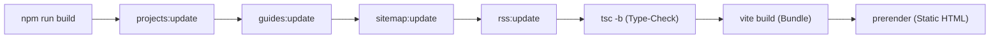

# Jürgen Jacobsen — Portfolio & Engineering Showcase

[](https://jurgen.fyi)
[](https://react.dev/)
[](https://www.typescriptlang.org/)
[](https://vite.dev/)
[](https://tailwindcss.com/)
[](LICENSE)
[](https://wakatime.com/badge/user/010adc07-6382-419f-87bc-0b3f507ee495/project/40495962-a255-4ec9-bd9d-e568a325077e)

Personal portfolio, software engineering project showcase, technical knowledge guides, and commercial aviation credentials of **Jürgen Jacobsen** — Commercial Pilot and Software Engineer.

> Live at **[**jurgen.fyi**](https://jurgen.fyi)**.

---

## Table of Contents

- [Overview](#overview)
- [Key Features](#key-features)
- [Tech Stack](#tech-stack)
- [Architecture & Project Structure](#architecture--project-structure)
- [Content Publishing Engine](#content-publishing-engine)
- [Build Pipeline & Automation](#build-pipeline--automation)
- [Getting Started](#getting-started)
- [Available Scripts](#available-scripts)
- [License](#license)

---

## Overview

This repository powers **jurgen.fyi**, a modern web application highlighting a dual-discipline journey across **Software Engineering** and **Commercial Aviation** (230+ flight hours, CPL, night rating, multi-engine endorsement).

### Architectural Highlights
- **Zero-Database Publishing Engine**: Full blog and portfolio publishing system powered by local Markdown files and automated build-time indexing scripts.
- **Static Generation & SEO**: Pre-renders route snapshots at build time (`scripts/prerender.js`) with comprehensive JSON-LD schemas (`Person`, `WebSite`, `Article`, `BreadcrumbList`), dynamic `sitemap.xml`, and RSS 2.0 feed (`/rss.xml`).
- **Tailwind CSS v4 & Motion**: Powered by Tailwind v4 with the `@tailwindcss/vite` plugin, customized design tokens, responsive typography, and choreographed entry animations.
- **Accessible & Responsive**: Fluid mobile-first navigation with interactive controls, headless Select menus, responsive grids, and print-ready styles.

---

## Key Features

### 💻 Code & Projects Showcase (`/code`, `/code/:projectSlug`)
- **Filterable & Searchable Grid**: Filter projects by technology tags, sort by date or title, and perform real-time full-text search.
- **Interactive Controls**: Fluid animated filter header that slides smoothly and displays a dedicated clear-filter button when filters or search terms are active.
- **Deep-Dive Project Views**: In-depth Markdown project documentation rendered with `react-markdown` and `remark-gfm`, complete with featured tags, external repository links, live demos, and a native Web Share API integration with clipboard fallback.

### 📚 Technical Knowledge Guides (`/guides`, `/guides/:slug`)
- **Local Markdown Publication**: Zero-database technical articles organized by categories (software architecture, developer workflows, aviation operations).
- **Automated Metadata Extraction**: Build-time indexing computes word count, estimated reading time, frontmatter attributes, and structured table of contents.
- **Syndication**: Auto-generated RSS feed (`/rss.xml`) for RSS readers and feed aggregators.

### 📄 Curriculum Vitae Viewer (`/cv`)
- **Multi-Version Switching**: Interactive dropdown toggle to switch between *Aviation Detailed Experience* (`aviation_CV.pdf`) and *General Experience* (`general_CV.pdf`).
- **State & URL Synchronization**: Two-way synchronization between URL search parameters (`?version=aviation` / `?version=general`) and the active document.
- **Embedded Document Viewer**: High-performance embedded PDF viewer (`<object>` with `<iframe>` fallback) supporting in-browser preview, direct downloading, one-click printing, and responsive full-screen mode.
- **Cascading Entry Animations**: Top-to-bottom animation sequence orchestrating the hero badge, headline, description, version selector, action buttons, and viewer.

### ✈️ Aviation Credentials (`/aviation`)
- Displays commercial aviation flight hours, type endorsements, ratings, flight records, and aviation cartography experience.

### 🛠️ Developer Blueprint (`/blueprint`)
- Curated catalog of developer configuration templates (`.editorconfig`, `.prettierrc`, ESLint configurations, and coding guidelines).
- Direct one-liner PowerShell installer script (`/blueprint/installer.ps1`) for rapid project bootstrapping.

### 📱 Contact & Socials (`/contact`, `/socials`)
- Direct communication channels, contact form integrations, and social profile links directory.

---

## Tech Stack

| Category | Technology | Description |
| :--- | :--- | :--- |
| **Core Framework** | [React 19](https://react.dev/) (`19.2.x`) | Modern React with latest hooks, concurrent features, and DOM handling |
| **Routing** | [React Router v7](https://reactrouter.com/) (`7.14.x`) | Client-side routing, nested routes, route redirects, and search params |
| **Build Tool** | [Vite 8](https://vite.dev/) (`8.0.x`) | Fast ESM bundler with `@vitejs/plugin-react` |
| **Language** | [TypeScript 6](https://www.typescriptlang.org/) (`~6.0.x`) | Strict static type checking across the entire application |
| **Styling** | [Tailwind CSS v4](https://tailwindcss.com/) (`4.2.x`) | Next-gen CSS engine via `@tailwindcss/vite` and `@tailwindcss/typography` |
| **Animations** | `tw-animate-css` | Smooth entrance animations and staggered transition delays |
| **Icons & UI** | [Lucide React](https://lucide.dev/), [Radix UI](https://www.radix-ui.com/) | Accessible headless primitives and vector icon library |
| **Content Processing** | `react-markdown`, `remark-gfm`, `gray-matter` | Markdown parser supporting tables, autolinks, footnotes, and YAML frontmatter |
| **Analytics** | `@vercel/analytics` | Lightweight performance and visitor metrics |
| **Code Quality** | ESLint 9, Prettier 3, TypeScript-ESLint | Automated linting, import sorting, and code formatting |

---

## Architecture & Project Structure

```text
portfolio/V2/
├── public/                       # Static public assets served directly
│   ├── blueprint/                # Config files and PowerShell installer
│   ├── cache/                    # Build-time JSON indexes (projects.json, guides.json)
│   ├── cv/                       # PDF resumes (aviation_CV.pdf, general_CV.pdf)
│   ├── guide/                    # Markdown technical guides
│   │   └── software/             # Software architecture & workflow articles
│   ├── img/                      # Portfolio screenshots, avatars, and assets
│   ├── projects/                 # Markdown project case studies
│   ├── robots.txt                # Search engine crawler instructions
│   ├── rss.xml                   # Auto-generated RSS 2.0 feed
│   ├── sitemap.xml               # Auto-generated XML sitemap
│   └── site.webmanifest          # PWA web application manifest
├── scripts/                      # Build-time automation and indexing scripts
│   ├── generate-rss.js           # Generates public/rss.xml
│   ├── guide-index.js            # Syncs guides metadata to public/cache/guides.json
│   ├── project-index.js          # Syncs projects metadata to public/cache/projects.json
│   ├── sitemap.js                # Crawls routes & generates public/sitemap.xml
│   └── prerender.js              # Generates pre-rendered HTML files for SEO
├── src/
│   ├── components/
│   │   ├── features/             # Feature-specific components
│   │   │   ├── aviation/         # Aviation hero and credential displays
│   │   │   ├── blueprint/        # Blueprint installer and files list
│   │   │   ├── contact/          # Contact details and hero
│   │   │   ├── guides/           # Guide cards, categories, and reader
│   │   │   ├── home/             # Home hero, highlights, and profile cards
│   │   │   └── projects/         # Project list, animated filters, header, and card
│   │   ├── layout/               # Global layout components (Navbar, Footer, SectionCard)
│   │   ├── shared/               # Shared utilities (SEO, Icon, ScrollToTop)
│   │   └── ui/                   # Reusable UI primitives (Select, Button, Input, Skeleton)
│   ├── lib/                      # Shared helper utilities (cn helper, utils)
│   ├── pages/                    # Top-level route pages (Home, Code, Aviation, CV, Guides, etc.)
│   │   └── subpages/             # Nested route subpages (CodeView.tsx)
│   ├── App.tsx                   # Main route configuration and layout shell
│   ├── index.css                 # Tailwind v4 theme, fonts, and global style directives
│   └── main.tsx                  # Application entry point
├── package.json                  # Dependencies, scripts, and project metadata
├── tsconfig.json                 # TypeScript compiler configuration
└── vite.config.ts                # Vite bundler configuration and path aliases
```

---

## Content Publishing Engine

### Adding a New Project
1. Create a new Markdown file inside `public/projects/<slug>.md`:
```markdown
---
title: "Project Title"
description: "A concise overview of the project."
createdAt: "2026-09-01"
updatedAt: "2026-09-15"
featured: true
tags: ["React", "TypeScript", "TailwindCSS"]
github: "https://github.com/jurgenjacobsen/repo"
demo: "https://demo.jurgen.fyi"
image: "/img/projects/preview.png"
---

## Project Overview
Detailed write-up, architecture, challenges, and solutions...
```
2. Run `npm run projects:update` (or run `npm run build`), which regenerates `public/cache/projects.json`.

### Adding a New Knowledge Guide
1. Place a new Markdown file inside a category directory under `public/guide/<category>/<slug>.md`:
```markdown
---
title: "Building Zero-Database Markdown Engines"
description: "How to structure local Markdown folders with build-time indexing."
category: "Software Architecture"
createdAt: "2026-09-17"
updatedAt: "2026-09-17"
tags: ["Architecture", "Vite", "Markdown"]
author: "Jürgen Jacobsen"
---

# Introduction
Full article content...
```
2. Run `npm run guides:update`, which parses the frontmatter, computes reading times, formats titles, and outputs `public/cache/guides.json`.

---

## Build Pipeline & Automation

The production build runs a fully orchestrated pre-build, compile, and post-render pipeline:



1. **`projects:update`**: Syncs projects from Supabase and updates `public/cache/projects.json`.
2. **`guides:update`**: Syncs guides from Supabase, extracts metadata/reading times, and generates `public/cache/guides.json`.
3. **`sitemap:update`**: Crawls dynamic project/guide slugs and static routes to build an up-to-date `public/sitemap.xml`.
4. **`rss:update`**: Builds an RSS 2.0 specification feed (`public/rss.xml`) from the latest projects and articles.
5. **`tsc -b`**: Runs strict TypeScript compilation checking across the codebase.
6. **`vite build`**: Compiles and optimizes static assets, client bundles, and CSS via Vite 8.
7. **`prerender`**: Generates pre-rendered HTML files for critical routes to ensure maximum SEO indexability and sub-second initial paint times.

---

## Getting Started

### Prerequisites
- **Node.js**: `v20.0.0` or higher
- **Package Manager**: `npm` (v10+), `pnpm`, or `yarn`

### Installation

1. Clone the repository:
   ```bash
   git clone https://github.com/jurgenjacobsen/portfolio.git
   cd portfolio/V2
   ```

2. Install dependencies:
   ```bash
   npm install
   ```

3. Generate initial metadata indices:
   ```bash
   npm run projects:update
   npm run guides:update
   ```

4. Start the local development server:
   ```bash
   npm run dev
   ```
   Open [http://localhost:5173](http://localhost:5173) in your browser.

---

## Available Scripts

| Command | Description |
| :--- | :--- |
| `npm run dev` | Launches the local Vite development server with hot module replacement (HMR) |
| `npm run build` | Executes the complete pipeline: index generation, sitemap, RSS, typecheck, Vite build, and prerendering |
| `npm run projects:update` | Scans projects from Supabase and outputs `public/cache/projects.json` |
| `npm run guides:update` | Scans guides from Supabase and writes `public/cache/guides.json` with reading time estimates |
| `npm run sitemap:update` | Updates `public/sitemap.xml` with all core, project, and guide routes |
| `npm run rss:update` | Builds the RSS 2.0 feed at `public/rss.xml` |
| `npm run prerender` | Pre-renders static HTML pages into `dist/` |
| `npm run lint` | Runs ESLint to check for code quality and syntax errors |
| `npm run prettier` | Formats all source files with Prettier |

---

## License

This project is licensed under the **GNU Affero General Public License v3.0** — see the [LICENSE](LICENSE) file for details.

---

## Author & Contact

**Jürgen Jacobsen**
- Website: [jurgen.fyi](https://jurgen.fyi)
- GitHub: [@jurgenjacobsen](https://github.com/jurgenjacobsen)
- Email: [jurgenjacobsen@outlook.com](mailto:jurgenjacobsen@outlook.com)
