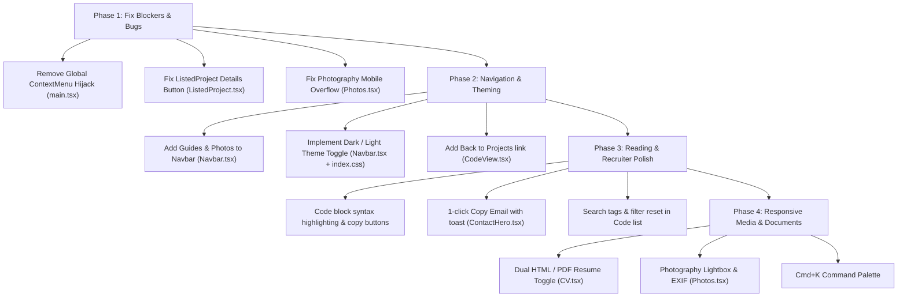

# UX Improvement Audit & Action Plan

A comprehensive breakdown of user experience (UX), accessibility (a11y), and usability improvements for **Jürgen Jacobsen** (`jurgen.fyi`), prioritized from critical interaction blockers to high-impact polish.

---

## 1. Executive Summary & Priority Matrix

| Priority | Issue / Area | Impact | Effort | Files Affected |
| :--- | :--- | :--- | :--- | :--- |
| **P0 - Critical** | Remove Global Context Menu Hijacking | High | Low | `src/main.tsx` |
| **P0 - Critical** | Fix Broken Details Button Logic | High | Low | `src/components/features/projects/ListedProject.tsx` |
| **P0 - Critical** | Fix Photography Mobile Overflow & Self-Link | High | Low | `src/pages/Photos.tsx` |
| **P1 - High** | Expose Theme Switcher (Dark/Light/System) | High | Medium | `src/components/layout/Navbar.tsx`, `src/index.css` |
| **P1 - High** | Promote "Guides" into Main Navigation | High | Low | `src/components/layout/Navbar.tsx` |
| **P1 - High** | Fix Navbar Route Reactivity & Missing Mobile Links | Medium | Low | `src/components/layout/Navbar.tsx` |
| **P1 - High** | Tag Searching & Reset Filters on Projects | Medium | Low | `src/pages/Code.tsx`, `src/components/features/projects/List.tsx` |
| **P2 - Medium** | Native HTML Resume View alongside PDF Embed | High | Medium | `src/pages/CV.tsx` |
| **P2 - Medium** | Markdown Syntax Highlighting & Code Copy Buttons | Medium | Medium | `src/pages/subpages/CodeView.tsx`, `src/components/features/guides/GuideContent.tsx` |
| **P2 - Medium** | 1-Click "Copy Email" with Visual Feedback | Medium | Low | `src/components/features/contact/Hero.tsx` |
| **P2 - Medium** | Fix Tailwind Dynamic Grid Classes on Downloads | Medium | Low | `src/components/features/projects/Download.tsx` |
| **P3 - Low** | Keyboard Quick Launcher / Command Palette (`Cmd+K`) | Medium | Medium | `src/components/layout/Navbar.tsx` |
| **P3 - Low** | Lightbox Image Modal for Photography | Medium | Medium | `src/pages/Photos.tsx` |

---

## 2. Critical Usability & Interaction Fixes

### 2.1 Remove Global Context Menu Hijacking
* **File:** `src/main.tsx` (Lines 67–96)
* **Problem:** The entire application is wrapped in `<ContextMenuTrigger>`, which invokes `e.preventDefault()` globally. This completely eliminates native browser right-click options across every page:
  * Users cannot right-click links to *"Open link in new tab"* or *"Copy link address"*.
  * Users cannot right-click images to save or open them.
  * Developers/inspectors cannot use *"Inspect Element"*.
  * Built-in browser spellcheck, text search, and dictionary actions are blocked.
* **Proposed Solution:**
  * Remove the global `<ContextMenuTrigger>` wrapping around `<App />`.
  * Relocate the existing options (*Share*, *Reload*, *Animations*) to standard UI elements such as a footer preferences dropdown, a navbar settings icon, or an accessible floating speed dial.

### 2.2 Fix Project Details Button Short-Circuit Bug
* **File:** `src/components/features/projects/ListedProject.tsx` (Lines 155–167)
* **Problem:** The JSX condition currently reads:
  ```tsx
  {project.link ||
      (project.slug && (
          <Button
              icon="BookOpen"
              link={project.link || `/code/${project.slug}`}
              title="Details"
              style="solid"
              className="flex-1 md:w-full"
          />
      ))}
  ```
  If `project.link` is defined (e.g. an external project URL), JavaScript short-circuits and evaluates to the string itself. React then prints the raw URL string directly onto the page rather than rendering the `<Button />`.
* **Proposed Solution:**
  ```tsx
  {(project.link || project.slug) && (
      <Button
          icon="BookOpen"
          link={project.link || `/code/${project.slug}`}
          title="Details"
          style="solid"
          className="flex-1 md:w-full"
      />
  )}
  ```

### 2.3 Fix Photography Mobile Typography Overflow & Self-Referential Link
* **File:** `src/pages/Photos.tsx` (Lines 17–55, 57–103)
* **Problem:**
  * Titles use `text-9xl` (128px) inside containers constrained by `aspect-21/9`. On mobile viewports (360px–420px), this aspect ratio produces a height of only ~150px–180px, causing the title, subtitle, and badge to collide and clip horizontally.
  * The *"View More"* button points to `/photos`, causing a redundant re-navigation while already on that page.
* **Proposed Solution:**
  * Use fluid typography: `text-4xl sm:text-6xl md:text-8xl lg:text-9xl`.
  * Make the aspect ratio adaptive: `aspect-4/3 sm:aspect-16/9 md:aspect-21/9`.
  * Change the button action to trigger a lightbox modal or expand the gallery.

---

## 3. Navigation, Discoverability & Wayfinding

### 3.1 Promote "Guides" into the Main Navigation
* **Files:** `src/components/layout/Navbar.tsx`, `src/pages/Guides.tsx`
* **Problem:** The Guides section is one of the most comprehensive features of the portfolio (featuring local read-tracking, table-of-contents auto-scrolling, reading time estimates, and markdown articles). However, it is entirely omitted from `Navbar.tsx` and can only be discovered by scrolling to the footer.
* **Proposed Solution:** Add `{ to: "/guides", label: "Guides", icon: BookOpenIcon }` to `NavbarItems` so visitors and recruiters discover technical writing immediately.

### 3.2 Fix Stale Route Tracking & Incomplete Mobile Menu
* **File:** `src/components/layout/Navbar.tsx` (Lines 87–101, 144–154)
* **Problem:**
  * Desktop checks `window.location.pathname` instead of React Router's reactive `location.pathname`, which can become out of sync during client-side transitions.
  * `HiddenItems` (like `/photos`) are omitted from the mobile slide-down menu, making them unreachable on mobile devices.
* **Proposed Solution:**
  * Unify navigation links into a single array driven by `useLocation().pathname`.
  * Ensure all active destination pages are available in both desktop and mobile navigation drawers.

### 3.3 Add Visible Breadcrumbs and "Back to Projects" Link
* **File:** `src/pages/subpages/CodeView.tsx`
* **Problem:** While JSON-LD breadcrumb schema is defined for search engines, there is no in-page back-link (e.g. `← Back to Projects`) at the top of a project detail page. Users who arrive via a direct link must either hit the browser back button or re-click "Code" in the navbar.
* **Proposed Solution:** Place a subtle breadcrumb navigation bar or `← Back to Projects` link above the project title card.

### 3.4 Introduce a Command Palette (`Cmd + K` / `Ctrl + K`)
* **Problem:** Power users, hiring managers, and developers often prefer fast keyboard navigation to jump directly to specific projects (e.g. "Archivum.md"), view ratings, copy email, or download the CV.
* **Proposed Solution:** Add a lightweight command palette dialog (using Radix UI Dialog or `cmdk`) accessible via a search button in the navbar or pressing `Cmd+K`.

---

## 4. Visual Comfort, Theming & Accessibility

### 4.1 Expose a Dark / Light Mode Switch
* **Files:** `src/index.css` (Lines 87–119), `src/components/layout/Navbar.tsx`
* **Problem:** High-contrast dark mode OKLCH variables are fully styled in `index.css`, but the `.dark` class is never applied to `<html>` because there is neither a theme toggle button nor a `prefers-color-scheme` listener.
* **Proposed Solution:**
  * Create a theme context/hook supporting `system`, `light`, and `dark`.
  * Listen to `window.matchMedia("(prefers-color-scheme: dark)")` for the system default.
  * Add a theme toggle button (Sun/Moon icon) to `Navbar.tsx`.

### 4.2 Markdown Syntax Highlighting & Code Copy Buttons
* **Files:** `src/pages/subpages/CodeView.tsx`, `src/components/features/guides/GuideContent.tsx`
* **Problem:** Markdown code blocks are currently rendered in raw monospace text with uniform colors.
* **Proposed Solution:**
  * Add code highlighting (e.g. `rehype-highlight` or `prismjs`).
  * Add a floating "Copy Code" button in the upper right corner of every code block with a confirmation checkmark upon click.

### 4.3 Add a Keyboard Skip Link
* **File:** `src/App.tsx` (Lines 36–39)
* **Problem:** Keyboard and screen-reader users must tab through all navigation links on every page transition before reaching the main content.
* **Proposed Solution:** Add a `<a href="#main-content" className="sr-only focus:not-sr-only focus:fixed focus:top-4 focus:left-4 z-50 px-4 py-2 bg-primary text-primary-foreground rounded-lg">Skip to content</a>` element.

---

## 5. Page-Specific Enhancements

### 5.1 Curriculum Vitae (`src/pages/CV.tsx`)
* **The Challenge:** Embedded PDF objects (`<object>` / `<iframe>`) have known rendering issues on mobile platforms (especially iOS Safari, where they only show the first page or fail entirely).
* **Improvements:**
  1. Add an **Interactive Web View** toggle alongside the **PDF View**. The web view presents an HTML timeline of:
     * Flight Licenses & Ratings (CPL, IR, MEP, Class 1 Medical).
     * Software Engineering Experience & Tech Stack.
     * Education and Key Achievements.
  2. Maintain the PDF download button for users who need the formal file.

### 5.2 Contact Page (`src/components/features/contact/Hero.tsx`)
* **The Challenge:** Clicking a `mailto:` link fails if the user does not have a native email client configured (common on Windows and Chromebooks).
* **Improvements:**
  1. Add a **"Copy Email"** button with a temporary toast / *"Copied!"* badge alongside the *"Send an Email"* link.
  2. Implement an optional lightweight contact form (backed by Web3Forms, Resend, or Formspree) for quick messages without leaving the browser.

### 5.3 Code & Projects (`src/pages/Code.tsx`, `src/components/features/projects/List.tsx`)
* **Improvements:**
  1. **Include Tags in Text Search:** Allow users to type "Go", "React", or "Python" into the search bar to filter projects by technology directly.
  2. **Clear Filters Button:** Display a *"Reset all filters"* button when search query or dropdowns yield 0 results.
  3. **Static Tailwind Grid Classes:** Replace `md:grid-cols-${displayedPlatforms.length}` in `Download.tsx` with static classes (`grid grid-cols-1 sm:grid-cols-2 md:grid-cols-3`) to prevent Tailwind v4 compiler purge issues.

### 5.4 Photography (`src/pages/Photos.tsx`)
* **Improvements:**
  1. **Fullscreen Lightbox Modal:** Enable clicking on any photo to open a high-resolution preview with zoom/close controls.
  2. **EXIF Metadata Cards:** Add camera, lens, focal length, aperture, and shutter speed badges for each featured photograph.

---

## 6. Implementation Roadmap


